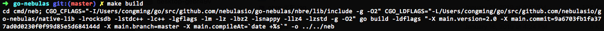
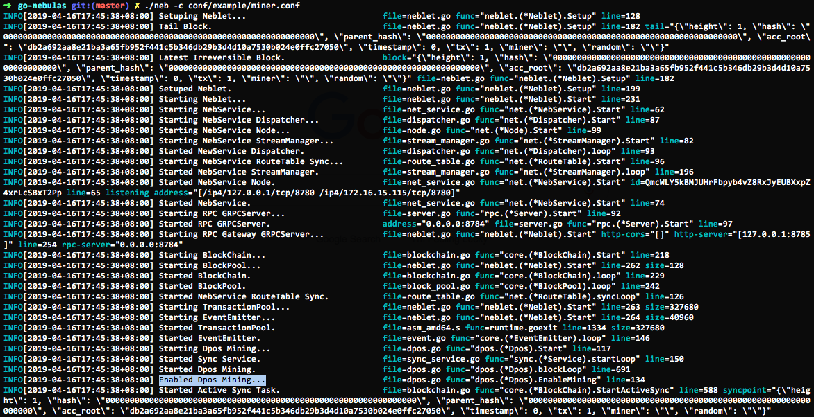

# 01 Compile and Install Nebulas

The current version of Nebulas Mainnet is 2.1.1, which is called Nebulas Nova. 

Nebulas Nova aims to discover the value of blockchain data, and it also means the future of collaboration.

Check our [Youtube Introduction](https://www.youtube.com/watch?v=jLIYkG35Ljo) for more details.


You can download the Nebulas source code to compile the private chain locally.

To learn about Nebulas, please read the Nebulas [Non-Technical White Paper](https://nebulas.io/docs/NebulasWhitepaper.pdf).

To learn about the technology, please read the Nebulas [Technical White Paper](https://nebulas.io/docs/NebulasTechnicalWhitepaper.pdf) and the Nebulas [github code](https://github.com/nebulasio/go-nebulas).

> At present, Nebulas can only run on Mac and Linux at this stage. The Windows version will be coming later.

## Golang Environment

Nebulas is implemented in Golang and C++.

| Components | Description |
| --- | --- |
| [Golang](https://golang.org) | The Go Programming Language, version &gt;= 1.12 |


### Mac OSX

[Homebrew](https://brew.sh/) is recommended for installing golang on Mac.

```bash
# install
brew install go

# environment variables
export GOPATH=/path/to/workspace
```

> Note: GOPATH is a local golang working directory which could be decided by youself. After GOPATH is configured, your go projects need to be placed in GOPATH directory.

### Linux

```bash
# download
wget https://dl.google.com/go/go1.12.linux-amd64.tar.gz

# extract
tar -C /usr/local -xzf go1.12.linux-amd64.tar.gz

# environment variables
export PATH=$PATH:/usr/local/go/bin
export GOPATH=/path/to/workspace
```

## Compile Nebulas

### Download

Clone source code with the following commands.

```bash
# enter workspace
cd /path/to/workspace

# download
git clone https://github.com/nebulasio/go-nebulas.git

# enter repository
cd go-nebulas

# master branch is most stable
git checkout master
```

### Build NEB

- Set up runtime environment
```bash
cd /path/to/workspace/go-nebulas
source setup.sh
```
- Build NEB
You can now build the executable for Nebulas:

```bash
cd /path/to/workspace/go-nebulas
make build
```

Once the building is complete，there will be an executable file `neb` generated under the root directory. 


## Start NEB

### Genesis Block

Before launching a new Nebulas chain, we have to define the configuration of genesis block.

#### Genesis Block Configuration

```text
# Neb genesis text file. Scheme is defined in core/pb/genesis.proto.

meta {
    # Chain identity
  chain_id: 100
}

consensus {
    dpos {
    # Initial dynasty, including all initial miners
        dynasty: [
            [ miner address ],
            ...
        ]
    }
}

# Pre-allocation of initial tokens
token_distribution [
    {
        address: [ allocation address ]
        value: [ amount of allocation tokens ]
    },
    ...
]
```

An example genesis.conf is located in `conf/default/genesis.conf`.

### Configuration

Before getting a neb node started, we have to define the configuration of this node.

#### Neb Node Configuration

```text
# Neb configuration text file. Scheme is defined in neblet/pb/config.proto:Config.

# Network Configuration
network {
    # For the first node in a new Nebulas chain, `seed` is not need.
    # Otherwise, every node need some seed nodes to introduce it into the Nebulas chain.
    # seed: ["/ip4/127.0.0.1/tcp/8680/ipfs/QmP7HDFcYmJL12Ez4ZNVCKjKedfE7f48f1LAkUc3Whz4jP"]

    # P2p network service host. support mutiple ip and ports.
    listen: ["0.0.0.0:8680"]

    # The private key is used to generate a node ID. If you don't use the private key, the node will generate a new node ID.
    # private_key: "conf/network/id_ed25519"
}

# Chain Configuration
chain {
    # Network chain ID
    chain_id: 100

    # Database storage location
    datadir: "data.db"

    # Accounts' keystore files location
    keydir: "keydir"

    # The genesis block configuration
    genesis: "conf/default/genesis.conf"

    # Signature algorithm
    signature_ciphers: ["ECC_SECP256K1"]

    # Miner address
    miner: "n1SAQy3ix1pZj8MPzNeVqpAmu1nCVqb5w8c"

    # Coinbase address, all mining reward received by the above miner will be send to this address
    coinbase: "n1FF1nz6tarkDVwWQkMnnwFPuPKUaQTdptE"

    # The passphrase to miner's keystore file
    passphrase: "passphrase"
}

# API Configuration
rpc {
    # GRPC API port
    rpc_listen: ["127.0.0.1:8684"]

    # HTTP API port
    http_listen: ["127.0.0.1:8685"]

    # The module opened
    http_module: ["api", "admin"]
}

# Log Configuration
app {
    # Log level: [debug, info, warn, error, fatal]
    log_level: "info"

    # Log location
    log_file: "logs"

    # Open crash log
    enable_crash_report: false
}

# NBRE configurations
nbre {
    # The root directory of NBRE, where the NBRE libraries located
    root_dir: "nbre"

    # NBRE log folder path
    log_dir: "conf/nbre/logs"

    # NBRE db location
    data_dir: "conf/nbre/nbre.db"

    # NBRE binary location
    nbre_path: "nbre/bin/nbre"

    # Administrator address used to submit tx and authorize specific account
    # with the right of IR submission. For more details, please check the NBRE 
    # related documents.
    admin_address: "n1S9RrRPC46T9byYBS868YuZgzqGuiPCY1m"

    # Height when the DIP takes effect
    start_height: 2307000

    # NEB and NBRE inter-process communication socket
    ipc_listen: "127.0.0.1"
    ipc_port: 8688
}

# Metrics Configuration
stats {
    # Open node metrics
    enable_metrics: false

    # Influxdb configuration
    influxdb: {
        host: "http://localhost:8086"
        db: "nebulas"
        user: "admin"
        password: "admin"
    }
}
```

A lot of examples can be found in `$GOPATH/src/github.com/nebulasio/go-nebulas/conf/`

## Run Nodes

> The Nebulas chain you are running at this point is private and is different with official Testnet and Mainnet.

Start your first Nebulas node with the following commands.

```bash
cd $GOPATH/src/github.com/nebulasio/go-nebulas
./neb -c conf/default/config.conf
```

After starting, the following should be visible in the terminal: 

By default, the node using `conf/default/config.conf` won't mine new blocks. Start your first Nebulas mining node with another commands.

```bash
cd $GOPATH/src/github.com/nebulasio/go-nebulas
./neb -c conf/example/miner.conf
```

After the node starts, if the connection with the seed node is successful, you can see the following log (detailed log can be found in: `logs/miner.1/neb.log`): 

> Note: You can start many nodes locally. Please make sure the ports in your node configurations won't conflict with each other.

### Next step: Tutorial 2

[Sending Transactions on Nebulas](02-transaction.md)

