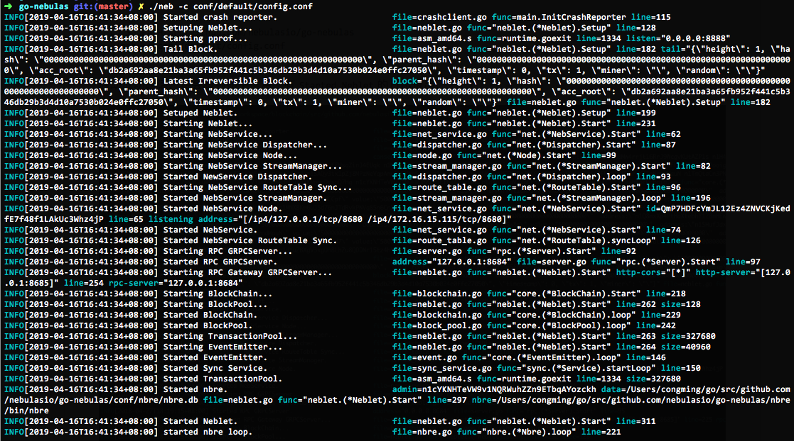

# Nebulas 101 - 01 Compilar e instalar Nebulas

La versión actual de Nebulas Mainnet es 2.0, que se llama Nebulas Nova.

Nebulas Nova pretende descubrir el valor de los datos de blockchain y también significa el futuro de la colaboración.

Consulta nuestra [introducción](https://www.youtube.com/watch?v=jLIYkG35Ljo) en YouTube para más detalles.

Puede descargar el código fuente de Nebulas para compilar la chain privada localmente.

* Para saber más acerca de Nebulas, sírvase leer el [libro blanco no-técnico](https://nebulas.io/docs/NebulasWhitepaper.pdf).
* Para aprender más acerca de su tecnología, léase el [libro blanco técnico](https://nebulas.io/docs/NebulasTechnicalWhitepaper.pdf) y el [código en github](https://github.com/nebulasio/go-nebulas).

> Por el momento, Nebulas sólo puede correr en entornos Mac y Linux. Estamos trabajando para lanzar la versión de Windows.

## Entorno Golang

Actualmente, Nebulas está escrito en Golang y C++.

| Componentes | Versión | Descriptión |
|----------|-------------|-------------|
| [Golang](https://golang.org) | The Go Programming Language, version &gt;= 1.12 |


### Mac OSX

Se recomienda [Homebrew](https://brew.sh/) para instalar Golang en entornos Mac:

```bash
# instalación
brew install go

# configuración de las variables de entorno
export GOPATH=/path/to/workspace
```

> **Importante:** GOPATH es una variable de entorno que apunta al directorio de trabajo local de golang, y que es personalizable. Luego de configurar GOPATH, es necesario guardar los proyectos GO en ese directorio.

### Linux

```bash
# descarga
wget https://dl.google.com/go/go1.12.linux-amd64.tar.gz

# extracción
tar -C /usr/local -xzf go1.12.linux-amd64.tar.gz

# configuración de las variables de entorno
export PATH=$PATH:/usr/local/go/bin
export GOPATH=/path/to/workspace
```

## Compilar Nebulas
### Descarga
Es necesario clonar el código fuente mediante estos comandos de consola:

```bash
# ingresar al espacio de trabajo
cd /path/to/workspace

# descargar
git clone https://github.com/nebulasio/go-nebulas.git

# ingresar al repositorio
cd go-nebulas

# la rama master es siempre la más estable
git checkout master
```

### Construcción de Neb
- Configurar el entorno de ejecución

```bash
cd /path/to/workspace
source setup.sh
```
- Build NEB
You can now build the executable for Nebulas:

```bash
cd /path/to/workspace
make build
```

Una vez que este proceso se completa, habrá un nuevo ejecutable, llamado `neb`, en el directorio raíz. 

## Iniciar neb
### Bloque inicial (Genesis Block)

Antes de crear un nuevo _blockchain_ Nebulas, es necesario definir la configuración del bloque inicial, o génesis.

#### Configuración del bloque inicial
```protobuf
# Esquema definido en core/pb/genesis.proto.

meta {
# Chain identity
chain_id: 100
}

consensus {
dpos {
# Dinastía inicial, incluyendo los mineros iniciales
dynasty: [
[ miner address ],
...
]
}
}

# Pre-asignación inicial de tokens
token_distribution [
{
address: [ allocation address ]
value: [ amount of allocation tokens ]
},
...
]
```

Existe un archivo genesis.conf de ejemplo en `conf/default/genesis.conf`.

### Nodo

Antes de poder lanzar un nodo neb, es necesario definir su configuración.

#### Configuración del nodo Neb

```text

# El esquema está definido en neblet/pb/config.proto:Config.

# Configuración de la red
network {
# Para el primer nodo en un blockchain Nebulas, no es necesario el parámetro `seed`.
# En otros casos, todo nodo requiere nodos seed que los “presenten” en el blockchain de Nebulas.
# seed: ["/ip4/127.0.0.1/tcp/8680/ipfs/QmP7HDFcYmJL12Ez4ZNVCKjKedfE7f48f1LAkUc3Whz4jP"]

# Servicio de alojamiento de la red p2p. Soporta múltiples IP y puertos.
listen: ["0.0.0.0:8680"]

# La clave privada se utiliza para generar el ID del nodo. Si no se utiliza una clave privada, el nodo generará un ID nuevo.
# private_key: "conf/network/id_ed25519"
}

# Configuración del blockchain
chain {
# ID de la red del chain (cadena)
chain_id: 100

# Ubicación del almacenamiento de la base de datos
datadir: "data.db"

# Ubicación de los archivos keystore de las cuentas
keydir: "keydir"

# Configuración del bloque inicial
genesis: "conf/default/genesis.conf"

# Algoritmo de firma (signature)
signature_ciphers: ["ECC_SECP256K1"]

# Dirección del minero
miner: "n1SAQy3ix1pZj8MPzNeVqpAmu1nCVqb5w8c"

# Dirección coinbase; todas las recompensas por minería se enviarán a esta dirección:
coinbase: "n1FF1nz6tarkDVwWQkMnnwFPuPKUaQTdptE"

# La palabra clave para acceder al archivo keystore del minero
passphrase: "passphrase"
}

# Configuración de la API
rpc {
# Puerto API GRPC
rpc_listen: ["127.0.0.1:8684"]

# Puerto API HTTP
http_listen: ["127.0.0.1:8685"]

# módulo http
http_module: ["api", "admin"]
}

# Configuración de registro
app {
# Log level: [debug, info, warn, error, fatal]
log_level: "info"

# Ubicación del registro
log_file: "logs"

# Habilitación del registro de errores; `false` para deshabilitarlo, `true` para habilitarlo
enable_crash_report: false
}

# Configuración de las métricas
stats {
# Habilitación de las métricas; `false` para deshabilitarlo, `true` para habilitarlo
enable_metrics: false

# Configuración de InfluxDB
influxdb: {
host: "http://localhost:8086"
db: "nebulas"
user: "admin"
password: "admin"
}
}

```

Existen distintos ejemplos que se pueden consultar en la carpeta `$GOPATH/src/github.com/nebulasio/go-nebulas/conf/`

## Correr nodos

**El blockchain Nebulas que se ha configurado hasta este momento es privado y difiere de las redes oficiales Testnet y Mainnet de Nebulas**.

Para crear un nuevo nodo Nebulas, es necesario ejecutar estos comandos:

```bash
cd $GOPATH/src/github.com/nebulasio/go-nebulas
./neb -c conf/default/config.conf
```

Luego de iniciado, se debería ver esta salida por terminal:


Por defecto, el nodo utiliza el archivo `conf/default/config.conf` y no minará nuevos bloques.
Para iniciar un nodo de minado Nebulas, ejecútese lo siguiente:

```bash
cd $GOPATH/src/github.com/nebulasio/go-nebulas
./neb -c conf/example/miner.conf
```

Luego de iniciado el nodo, y si se conecta de forma satisfactoria con el nodo _seed_, se verá la siguiente salida en el registro `logs/miner/neb.log`:


### IMPORTANTE

Es posible iniciar una cantidad arbitraria de nodos de forma local. Es necesario asegurarse de que los puertos especificados en los archivos de configuración no entren en conflicto entre sí.

## Capítulo siguiente: parte 2 del tutorial:

[Enviar transacciones en Nebulas](https://github.com/nebulasio/wiki/blob/master/tutorials/%5BEspa%C3%B1ol%5D%20Nebulas%20101%20-%2002%20Transacciones.md)
