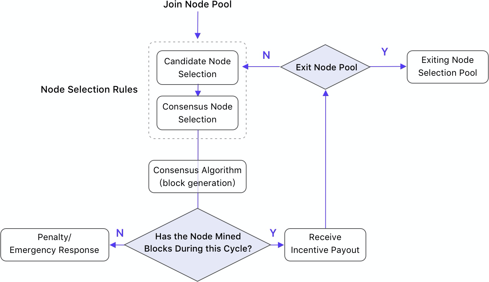
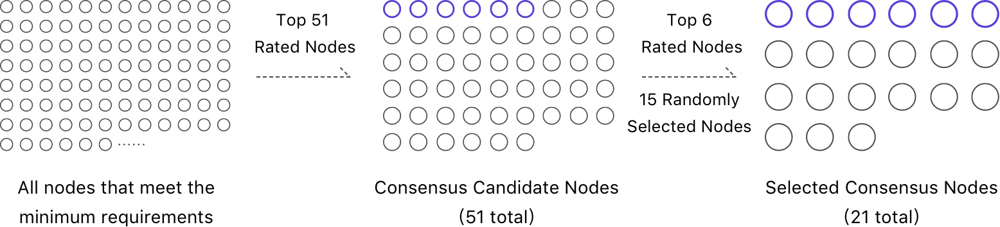

# 2. 共识机制

**本章节主要介绍PoD机制的共识机制部分，具体如下：**

* [2.1 节点入选基础条件](#id1)
* [2.2 节点选取规则](#id2)
	* [2.2.1 候选节点综合排名算法](#id3)
		* [2.2.1.1 NAX投票数](#nax)
		* [2.2.1.2 出块稳定指数](#id5)
	* [2.2.2 共识节点选取算法](#id6)
* [2.3 共识算法](#id7)
	* [2.3.1 出块顺序](#id8)
	* [2.3.2 打包出块](#id9)
	* [2.3.3 区块上链确认](#id10)
* [2.4 退出机制](#id11)
	* [2.4.1 撤销投票](#id12)
	* [2.4.2 节点退出](#id13)
* [2.5 惩罚和应急响应](#id14)
	* [2.5.1 惩罚](#id15)
		* [2.5.1.1 出块惩罚](#id16)
		* [2.5.1.2 治理惩罚](#id17)
	* [2.5.2 应急响应](#id18)

共识机制使用智能合约自动管理，主要由节点选取规则和共识算法两部分组成，联合完成出块，保障主网正常运行。

星云链平均出块时间为15秒。设定每个轮询周期内，21个共识节点轮番出块，每个节点出块10个。故**一个轮询周期默认为210个区块高度**，约为52.5分钟。每个轮询周期内的共识机制执行流程如下图所示：

*图2.1 每个轮询周期的共识机制执行流程*

## 2.1 节点入选基础条件

任何个人或组织均可申请成为节点，必须满足以下所有要求才有资格参与候选节点选取：

*   服务器满足基本要求（参见[附录A 推荐硬件配置](appendix.html#a)）；
*   服务器保证运行中；
*   质押（即投票）不小于10万NAX；
*   保证金质押2万NAS；
*   没有高安全等级作恶记录（参见[2.5.1 惩罚](#id15)）

## 2.2 节点选取规则

节点选取规则包括两个步骤：

1. **候选节点选取：** 在每个轮询周期内，在满足基本入选要求的所有节点中，按候选节点综合排名算法，选出51个候选节点；
2. **共识节点选取：** 在每个轮询周期内，按共识节点选取算法，在稳定且最能代表用户权益的一组候选节点中选出21个共识节点。共识节点负责出块，可以获得共识机制激励。

候选节点和共识节点共同构成共识委员会。选取流程如下图所示：

*图2.2 节点选取流程*

### 2.2.1 候选节点综合排名算法

在满足申请节点基本要求（[2.1 节点入选基础条件](#id1)）的前提下，将所有节点按候选节点综合排名算法进行排名，靠前的51个节点为候选节点。候选节点综合排名算法参考两个因素：NAX投票数V(i)和出块稳定指数S(i)。候选节点综合排名指数R(i)为：

> R(i) = V(i) × S(i)

假设S(i)相同，NAX投票数V(i)也相同，则最先达到NAX投票数V(i)的节点入选。

#### 2.2.1.1 NAX投票数

NAX投票数V(i)：所有社区成员和节点负责人都可以向支持的节点投出NAX，助力该节点提升排名。

#### 2.2.1.2 出块稳定指数

出块稳定指数S(i)：由共识节点成功出块的比率决定。未出过块的节点初始值S为0.8。在每个轮询周期内，一个候选节点有未参与出块、成功出块、漏出块三种情况。

**A 未参与出块**

未参与出块的候选节点下一周期的S(i+1)为：

S(i+1) = S(i) + 0.01

如果该节点持续未参与出块，S(i)最高恢复到初始值S=0.8。

**B 成功出块**

共识节点在一个轮询周期内需要出块10个。如果10个块全部出了则下一周期的S(i+1)为：

S(i+1) = S(i) + 0.1 (S <= 1)

S(i)逐步提升到1。一般情况下，稳定出块的节点S(i) = 1。

**C 漏出块**

如果该共识节点发生漏出块的情况，则下一周期的S(i+1)为：

S(i+1) = S(i) × (10 - C) / 10

其中，C为漏出块个数。C越大，S(i)值约低。如果S(i)降至阈值K（K初始值为0.5），则该共识节点在未来20个轮询周期中都不能入选候选节点，详见[2.5.1 惩罚](#nax)。

### 2.2.2 共识节点选取算法

共识节点从51个候选节点中选出。从候选节点中选取共识节点的具体方式如下：

1. 排名前6的候选节点直接入选。
2. 剩余15个共识节点的名额按如下公式从排名第7到第51名的候选节点中选取：

> RConsensus = (R(i) / Sum(R)) × Random()

各参数说明如下：

**RConsensus：** 共识节点排名指数。

**R(i)：** 候选节点综合排名指数。R(i)已经综合了两个因素：NAX投票数V(i)和出块稳定指数S(i)，故可以认为R(i)同时考虑了节点的社区支持度和历史出块贡献。

**Sum(R)：** 51个候选节点的综合排名指数总和。R(i)/Sum(R)可以看作是该节点的贡献度在所有51个候选节点中的占比。

**Random()：** 随机概率。

## 2.3 共识算法

共识算法基于DPoS共识机制，通过共识委员会共识节点调度生产下一个轮询周期的区块。21个共识节点轮流出块。在一个轮询周期结束后，切换到下一个轮询周期的共识节点，轮流出块。

区块确认使用BFT[[1]](#f1)共识保证区块上链的一致性，以实现PoD的稳定性、公平性和安全性。

### 2.3.1 出块顺序

一个轮询周期内的出块顺序由21个共识节点经过VRF[[2]](#f2)随机排序。在每个轮询周期内，负责出块的共识节点和顺序始终保持不变。

### 2.3.2 打包出块

共识节点在出块时会打包交易缓存池中的交易。具体方式如下：

1. 共识节点严格按照该轮询周期内的出块顺序和时间打包出块；
2. 在打包时间内尽可能多的打包未上链交易；
3. 优先打包GasPrice高的交易；
4. 不可上链的交易在执行失败后会被丢掉。

### 2.3.3 区块上链确认

共识节点的区块上链确认保证了链的一致性和安全性，并对作恶节点进行惩罚。区块上链遵循如下规则：

1. 优先选取最长子链作为最优链；
2. 在长度一致的子链中按哈希排序选择最优链；
3. 最后不可逆区块使用BFT共识需要⅔+1的共识节点确认；
4. 对非出块时间出块，双花等攻击采取惩罚机制（参见[2.5.1 惩罚](#id15)）。

## 2.4 退出机制

PoD的投票是公平的自由博弈场景。所有社区成员都可以随时申请撤销NAX投票或退出节点选取。

### 2.4.1 撤销投票

所有社区成员或组织，可以随时发起撤销投票的申请。当撤销投票申请成功提出后，该节点的NAX投票数（[2.2.1.1 NAX投票数](#nax)，V(i)）即刻下调，即时影响下一轮询周期该节点排名。按照[2.1 节点入选基础条件](#id1)，如果NAX投票数低于10万NAX，该节点无法入选候选节点。

**所撤销投票的额度：** 可以任意设置。但所有社区成员或组织只能申请撤销自己投出的NAX。

**NAX返还时间：** 撤销投票申请成功提交后120个轮询周期（约为5天）后返还NAX至原地址。

### 2.4.2 节点退出

所有节点都可以随时退出。一旦选择退出，该节点将即刻失去成为下一周期候选节点的资格。

**保证金返还额度：** 一次性全额返还，不可选择额度。

**保证金返还时间：** 节点退出申请成功提交后820个轮询周期（约为1个月）后返还NAS至原地址。

**NAX返还时间：** 节点退出申请成功提交后120个轮询周期（约为5天）后返还所有参与者的NAX至原地址。

## 2.5 惩罚和应急响应

### 2.5.1 惩罚

#### 2.5.1.1 出块惩罚

为了维护PoD系统的安全性，根据情节严重情况进行相应的惩罚，增加节点作恶成本。三种针对共识节点的出块惩罚如下：

<table>
  <tr>
   <td rowspan="2" >安全等级
   </td>
   <td rowspan="2" >危害
   </td>
   <td rowspan="2" >举例
   </td>
   <td colspan="2" >惩罚
   </td>
  </tr>
  <tr>
   <td>选取限制
   </td>
   <td>惩罚金
   </td>
  </tr>
  <tr>
   <td>低
   </td>
   <td>造成系统不流畅
   </td>
   <td>发生漏出块等间断性不参与共识的情况
   </td>
   <td>出块稳定指数S(i)（[2.2.1.2](#id5)）下降，当降至0.5以下则20个轮询周期内（约为1天）不得入选候选节点
   </td>
   <td>不冻结
   </td>
  </tr>
  <tr>
   <td>中
   </td>
   <td>造成系统不稳定
   </td>
   <td>一个周期内一个块也没出
   </td>
   <td>20个轮询周期内（约为1天）不得入选候选节点
   </td>
   <td>冻结5%保证金
   </td>
  </tr>
  <tr>
   <td>高
   </td>
   <td>威胁系统安全
   </td>
   <td>同一高度出多个块或在不应出块的时候出块、女巫攻击等
   </td>
   <td>永久冻结
   </td>
   <td>冻结全额保证金和该节点所有NAX（含用户所投）
   </td>
  </tr>
</table>

表2.1：共识机制安全等级表

中、高安全等级惩罚处理流程：

1. 当发生安全问题时，选取限制自动执行，并冻结相应惩罚金。
2. 在最近一个治理周期投票阶段，由治理委员会投票判定该节点惩罚是否成立。
    1. 如果投票通过该共识节点危害PoD系统安全性的行为属实，则对该节点的惩罚有效，选取限制继续执行，冻结中的惩罚金捐赠给Go.nebulas社区协作基金（参见[3.2.2 社区资产](governance.html#id4)）。
    2. 如果投票不通过，该节点未对系统安全性造成危害，则选取限制终止，出块稳定指数S(i)恢复为惩罚前的数值，已被冻结的惩罚金解冻。

具体参见3.2 治理范围的[3.2.3 共识机制惩罚](governance.html#id5)和[3.3.3 投票结果处理](governance.html#id9)。

#### 2.5.1.2 治理惩罚

除了出块惩罚，当出块节点当选治理节点后，如果在连续2个治理周期内没有完成治理任务，则820个轮询周期内（约一个月）不能入选候选节点。详情参见[3.4.1 单个治理节点惩罚](governance.html#id11)。

### 2.5.2 应急响应

如果发生黑客攻击主网等突发事件，为了保证主网可以快速相应，降低危害，星云基金会预留应急合约管理方法，星云基金会可以即刻将有问题的地址加入黑名单，禁止该地址转账。

整个流程公开透明。紧急处理后星云基金会应回溯事件过程和处理方式，接受社区监督。

***

[[1]](#a1) **BFT（Byzantine Fault Tolerance）即拜占庭容错：** 是分布式计算领域的容错技术，拜占庭容错来源于拜占庭将军问题。拜占庭将军问题是对现实世界的模型化，由于硬件错误、网络拥塞或中断以及遭到恶意等原因，计算机和网络可能出现不可预料的行为。拜占庭容错技术被设计用来处理现实存在的异常行为，并满足所要解决的问题的规范要求。

[[2]](#a2) **[11] VRF（Verifiable Random Function）可验证随机函数：** 是一种将输入映射为可验证的伪随机输出的加密方案。该方案是由Micali（Algorand的创建者）、Rabin以及Vadhan于1999年提出的。至今VRF已广泛应用于各种加密场景、协议和系统中。

