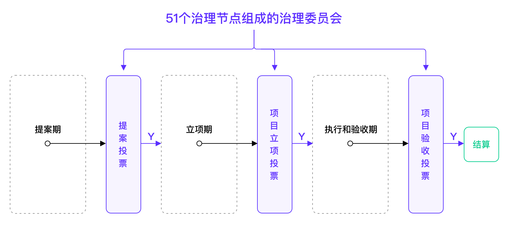

# 3. 治理机制

**本章节主要介绍PoD机制的治理机制部分，具体如下：**

* [3.1 治理委员会](#id1)
* [3.2 治理范围](#id2)
	* [3.2.1 社区协作](#id3)
	* [3.2.2 社区资产](#id4)
	* [3.2.3 共识机制惩罚](#id5)
* [3.3 治理手段：投票](#id6)
	* [3.3.1 投票周期](#id7)
	* [3.3.2 投票手段](#id8)
	* [3.3.3 投票结果处理](#id9)
* [3.4 惩罚机制](#id10)
	* [3.4.1 单个治理节点惩罚](#id11)
	* [3.4.2 治理失效](#id12)

星云链关注不同角色在去中心化协作中对生态作出的贡献，治理机制是PoD的重要组成部分。治理机制是由治理委员会负责，以链上投票为主要手段，对社区协作和社区资产进行管理，从而实现社区自治的一系列机制。

## 3.1 治理委员会

治理机制的执行由治理委员会负责管理。治理委员会由治理节点组成。

**治理周期：**每820个轮询周期（约1个月）为一个治理周期。

**治理节点选取：**治理节点从共识委员会中选出，在一个治理周期内（820个轮询周期），出块数最多的51个共识节点有资格成为下一治理周期治理节点。如果出块数一样多，则先达到该出块数的节点排名靠前。

## 3.2 治理范围

### 3.2.1 社区协作

星云社区的提案机制是星云自治元网络的重要组成部分。当前星云社区的提案和项目都通过星云协作平台Go.nebulas（[go.nebulas.io](http://go.nebulas.io/)）展示和管理，所有社区成员都可以在Go.nebulas上提出自己对星云未来发展的意见和建议，提案包括但不限于[[1]](#f1)：

1. 星云主网研发
2. 社区协作流程优化、治理建议等
3. 现有星云社区产品的升级迭代、Bug提报
4. 社区生态产品的开发和维护
5. 社区运营和市场拓展

一个建议从提出到落地执行，会经过四个阶段：

1. 提案期
2. 立项期
3. 项目执行期
4. 验收期

每一步都需要通过治理委员会投票决议。治理委员会在每个治理周期内有3类投票任务：

1. 提案投票：对该周期内星云社区的提案进行投票，决定是否通过。
2. 项目立项投票：对该周期内参与立项的项目进行投票，决定是否可以执行并批准预算。
3. 项目验收投票：对该周期内提交测试的项目进行投票，决定项目是否可以验收结算。

治理委员会治理流程如下图：

*图3.1 治理委员会投票治理流程*

**提案期：** 社区成员在星云协作平台Go.nebulas（[go.nebulas.io](http://go.nebulas.io/)）上自由发起和分享提案。

**立项期：** 对通过提案投票的项目进行处理。按照执行情况，提案分为两类：

1. **无需申请预算的提案。** 比如提案内容为星云发展方向探讨、治理组织结构调整建议、主网参数调整等。通过提案投票后，可以由相关负责人快速推进执行。
2. **需要申请预算的提案。** 此过程由Go.nebulas运营团队协助沟通，并对预算进行把关。提案人可以按照Go.nebulas的标准模版提出预算、项目目标、执行步骤和工期，申请自己执行或在社区悬赏执行人。

**执行和验收期：** 执行和验收期为Go.nebulas内部运作流程，治理委员会无需亲自参与。主要分为三个阶段：

1. 悬赏期：由提案人或Go.nebulas运营团队担任项目发起人，发起项目悬赏，社区成员可自由申领；
2. 执行期：项目发起人确认项目负责人，项目负责人开始执行并提交项目结果；
3. 测试期：项目发起人Go.nebulas运营团队组织验收，并出具是否通过该项目的建议报告，供治理委员会参考。

### 3.2.2 社区资产

治理委员会负责管理社区公共资产的使用。社区公共资产包括：

1. **Go.nebulas社区协作基金的使用和分发**

    此部分资金的初始来源是自星云2018年3月30日主网上线至节点去中心化之前，已经产生的DPoS记账收益。其中，除去已使用的部分（如星云激励计划奖励），剩余部分将在节点去中心化之后归入Go.nebulas社区协作基金。

    由于当前每个治理周期的项目总金额上限为不大于30,000 USDT，故启动治理机制后半年内的实际使用为180,000 USDT等额NAS。

2. **星云节点计划激励分配**

    星云节点计划激励包括共识机制激励和治理机制激励两部分。来源为DPoS每日产生的8,219.1744 NAS记账收入。具体分配方法参见[1.3 激励分配](overview.html#id3)。

公共资产的使用、分配方案改动等，都需要经过提案流程，由治理委员会投票决议通过后方可执行。

### 3.2.3 共识机制惩罚

治理委员会同时需要对该治理周期内发生的中、高安全等级惩罚（参见[2.5.1 惩罚](consensus.html#id15)）情况进行投票决议。

1. 如果投票通过该共识节点危害PoD系统安全性的行为属实，则对该节点的惩罚有效，选取限制继续执行，已冻结的惩罚金捐赠给Go.nebulas社区协作基金。
2. 如果投票不通过，该节点未对系统安全性造成危害，则选取限制终止，出块稳定指数S(i)恢复为惩罚前的数值，已被冻结的惩罚金解冻。

## 3.3 治理手段：投票

### 3.3.1 投票周期 

治理节点可以在前一个治理周期结束后120个轮询周期内（约为5天）进行投票。逾期视为自动放弃。

### 3.3.2 投票方法

治理节点投票为公开非匿名链上投票。治理节点应参与该治理周期内的**所有**投票。每个投票有三种选项（必选一个）：

*   支持
*   反对
*   弃权

每个提案只能投一次，每次投出1 NAX。投票使用的NAX直接销毁，不返还。

### 3.3.3 投票结果处理

一个提案或项目的通过在不同投票阶段需要满足以下不同条件：

<table>
  <tr>
   <td>投票阶段
   </td>
   <td>治理节点参与度
   </td>
   <td>通过率
   </td>
   <td>预算限制
   </td>
  </tr>
  <tr>
   <td>提案投票
   </td>
   <td>不少于26个
   </td>
   <td>50%以上
   </td>
   <td>无
   </td>
  </tr>
  <tr>
   <td>项目立项投票
   </td>
   <td>不少于26个
   </td>
   <td>67%以上
   </td>
   <td>单个项目预算不大于15,000 USDT *；

该治理周期内通过的项目总金额不大于30,000 USDT **
   </td>
  </tr>
  <tr>
   <td>项目验收投票
   </td>
   <td>不少于26个
   </td>
   <td>67%以上
   </td>
   <td>/
   </td>
  </tr>
  <tr>
   <td>共识机制惩罚
   </td>
   <td>不少于26个
   </td>
   <td>67%以上
   </td>
   <td>/
   </td>
  </tr>
</table>

*表3.1：投票结果处理表*

\* 单个项目预算如果超出，建议拆分为多期项目进行。

** 如果该治理周期内通过的项目总金额超预算，则按支持率排名，排名靠后的提案顺延到下一治理周期立项。

## 3.4 惩罚机制

### 3.4.1 单个治理节点惩罚

如果一个节点连续2个治理周期成为治理节点却没有完成全部治理投票，则820个轮询周期内（约一个月）不能入选候选节点。

### 3.4.2 治理失效

1. 如果某治理周期内参与投票的治理节点少于26个，本次治理宣告失效，则治理机制激励捐赠给Go.nebulas社区协作基金（参见[3.2.2 社区资产](#id4)）。
2. 如果某治理周期内一个提案和项目都没有，即没有可进行的投票，则本次治理宣告失效。治理机制激励捐赠给Go.nebulas社区协作基金。

***

[[1]](#a1) [Go Nebulas帮助文档](https://www.notion.so/Go-nebulas-io-09e7158463b443f3822fbc624bb394fd)

