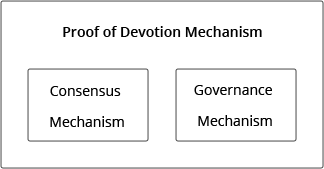
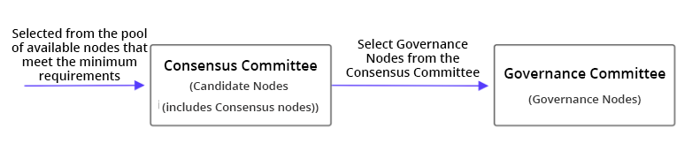

# 1. PoD概述

**贡献度证明机制（PoD）概述**

* [1.1 设计目标](#id1)
* [1.2 构成](#id2)
* [1.3 激励分配](#id3)
* [1.4 载体：NAX](#id4)

## 1.1 设计目标

要建设可持续发展的良性公链⽣态，需要同时兼顾共识机制的快速和不可逆性，以及治理的公平性。

当前我们面对新的应用场景，信息交互从单一、简单的功能向复杂、多样发展，用户角色也越来越多。协作场景已经从人与人面对面合作，升级到全球化的跨越多地区、并有多组织参与的协 作。协作的目标结果也更为多变，成果从实物到虚拟，协作的时间跨度也变得更长、更灵活。[[1]](#f1)

要保证新应用场景的治理公平性，需要采用新的协作方式。传统的中心化治理无法应对复杂的新场景。面对复杂的数据交互形态和丰富的用户角色，中心化的单一评判标准很难做到广而全面，有相当的局限性。

而传统的去中心化协作方式因为没有考虑到更多角色的存在引起的新的利益分配情况，或多或少存在利益分配不均、无法长期良性发展或者发展缓慢的情况。

如何保障社区成员的利益，让生态沉淀出价值深度，是星云在思考和实践的方向。在优先保证效率和不可逆的前提下，我们设计PoD就是为了从贡献度角度出发，尽可能追求公平性，维护社区用户的利益。

## 1.2 构成

PoD可以简单地概述为以社区贡献者贡献大小为基础构建的机制，该机制包括共识机制和治理机制两部分。参见图1.1。

*图1.1 PoD构成*

PoD的人员组成涉及两个执行委员会：共识委员会和治理委员会。

*   共识委员会：共识机制由共识委员会执行。共识委员会通过综合排名算法从所有节点中选出。
*   治理委员会：治理机制由治理委员会落实而治理委员会由共识委员会中贡献最大的共识节点组成。

*图1.2 PoD执行委员会*

## 1.3 激励分配

自2018年3月31日星云主网上线以来，临时共识机制DPoS[[2]](#f2)每日全网产生8,219.1744 NAS记账收入，每年全网产生2,999,941 NAS。这部分记账收入将全部用于星云节点计划。其中，共识机制和治理机制两部分的激励比例约为5:1。即：

1. 每年全网共识机制激励总量：2,499,951 NAS
2. 每年全网治理机制激励总量：499,999 NAS

共识机制激励由共识委员会轮询周期内出过块的共识节点均分。没有入选共识节点的候选节点在该周期内没有激励。

治理机制激励由治理委员会治理周期内参与过**所有**投票的治理节点均分。没有参与或只参与过部分投票的治理节点在该周期内没有激励。

## 1.4 载体：NAX

贡献度证明的载体是NAX[[3]](#f3)。NAX仅可以通过去中心化质押（dStaking）[[4]](#f4)的方式，质押NAS而得。根据 **《星云链NAX白皮书》** （[Github](https://github.com/nebulasio/nax_whitepaper), [PDF](https://nextdao.io/static/docs/nax_whitepaper_zh.pdf)）所述，NAX采用动态分发策略，实际总发行量与全局质押率相关，某地址获得NAX的数量与NAS质押量以及币龄相关，可以看作是衡量了该地址对社区作出的持币贡献。因此，NAX可以被看作为星云生态的贡献有效凭证。

在星云社区协作平台[Go Nebulas](https://go.nebulas.io)上，也将以NAX作为生态贡献激励，鼓励社区成员建设社区。

***

[[1]](#a1) [Orange Paper: Nebulas Governance 星云治理橙皮书](https://nebulas.io/docs/NebulasOrangepaperZh.pdf)

[[2]](#a2) **Delegated Proof of Stake Consensus（DPoS）：** 由持币的利益相关方投票来选择代表，代表们再以民主投票的方式决定共识问题。包括但不限于：所有网络参数、费用估算、块间隔、交易规模等。

[[3]](#a3) **NAX：** 通过去中心化质押产生。nextDAO上的首个Token。用户通过质押NAS获得NAX。NAX采用动态分发策略，实际总发行量与全局质押率相关，用户个人获得NAX的数量与NAS质押量以及币龄相关。

[[4]](#a4) **dStaking 去中心化质押：** 区别于需要向合约转账的传统质押，去中心化质押的合约记录着用户的质押契约，用户资产仍然存放在用户个人地址之上。

